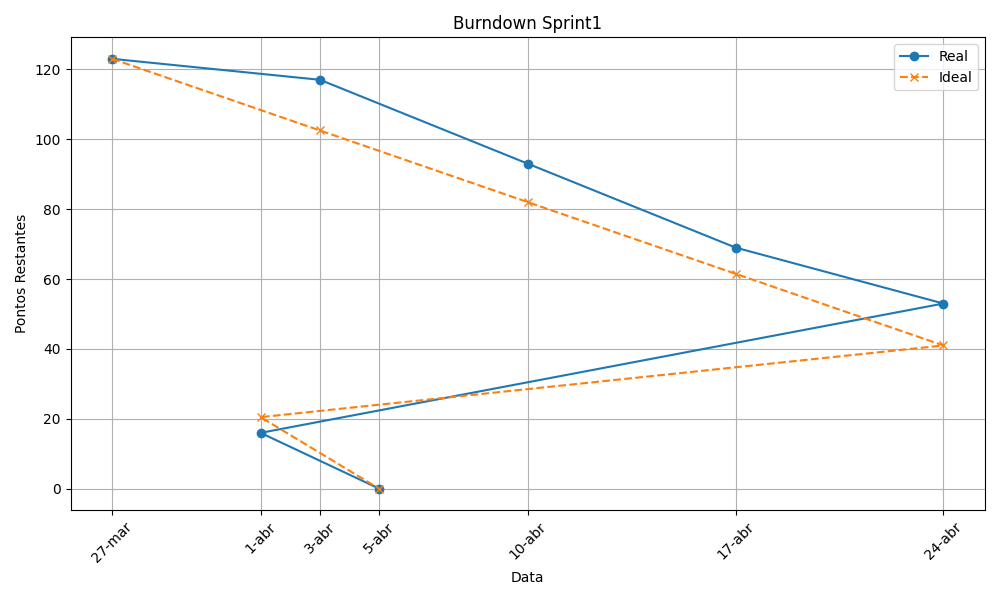

<h1>🚀 2DSM-ABP-UNDEFINED</h1>

Este repositório contém o desenvolvimento do projeto interdisciplinar da disciplina de
<strong>Aprendizagem Baseada em Problemas (ABP)</strong> do curso de
<strong>Desenvolvimento de Software Multiplataforma</strong> da FATEC Jacareí.

<h2>📌 Sumário</h2>

<ul>
<li><a href="#sobre">📖 Sobre o Projeto</a></li>
<li><a href="#tecnologias">🛠️ Tecnologias Utilizadas</a></li>
<li><a href="#requisitos">📑 Requisitos</a></li>
<li><a href="#userstories">📝 User Stories</a></li>
<li><a href="#integrantes">🧑‍💻 Integrantes</a></li>
</ul>

<h2>🚀 Planejamento de Sprints</h2>

<ul>
<li>
<a href="#sprint1">⏱️ Sprint 1</a>
<ul>
<li><a href="#backlogsprint1">📋 Backlog</a></li>
<li><a href="#burndownsprint1">📉 Burndown</a></li>
</ul>
</li>

<li>
<a href="#sprint2">⏱️ Sprint 2</a>
<ul>
<li><a href="#backlogsprint2">📋 Backlog</a></li>
<li><a href="#burndownsprint2">📉 Burndown</a></li>
</ul>
</li>

<li>
<a href="#sprint3">⏱️ Sprint 3</a>
<ul>
<li><a href="#backlogsprint3">📋 Backlog</a></li>
<li><a href="#burndownsprint3">📉 Burndown</a></li>
</ul>
</li>
</ul>

<h2>📎 Links</h2>

<ul>
<li>
<strong>Trello:</strong>
<a href="https://trello.com/b/T7wMGhWx/2dsm-abp-undefined" target="_blank">
Acessar Trello
</a>
</li>

<li>
<strong>Figma:</strong>
<a href="https://www.figma.com/design/OK2prSv5yx73jHEhxO9pOu/ABP-2026---1?node-id=0-1&t=8MzKwBBqUopxgXZS-1" target="_blank">
Acessar Figma
</a>
</li>

</ul>

<h2 id="tecnologias">🛠️ Tecnologias Utilizadas</h2>

O desenvolvimento será realizado com as seguintes tecnologias, visando garantir performance e acessibilidade na aplicação.

<h3>🔧 Stack Principal</h3>

<ul>
<li>

React
</li>

<li>

TypeScript
</li>

<li>

CSS
</li>

<li>

PostgreSQL
</li>
</ul>

<h2 id="requisitos">📑 Requisitos</h2>

<h3>✅ Requisitos Funcionais</h3>

<table>
<tr>
<th>Código</th>
<th>Descrição</th>
</tr>

<tr>
<td>RF01</td>
<td>Navegação conversacional por menus e submenus hierárquicos em formato de chatbot, com fluxo condicionado às escolhas do usuário e baseado em dados armazenados no banco.</td>
</tr>

<tr>
<td>RF02</td>
<td>Repositório estruturado contendo nós de navegação, perguntas e respostas, documentos oficiais, trechos indexados (chunks) e metadados da fonte.</td>
</tr>

<tr>
<td>RF03</td>
<td>Perfis de usuário: Aluno (público), Secretária Acadêmica (autenticado) e Administrador (autenticado).</td>
</tr>

<tr>
<td>RF04</td>
<td>Administrador pode gerenciar conteúdo (criar, editar, excluir nós), documentos, usuários e visualizar logs.</td>
</tr>

<tr>
<td>RF05</td>
<td>Envio de perguntas à Secretaria Acadêmica com texto da dúvida e e-mail institucional.</td>
</tr>

<tr>
<td>RF06</td>
<td>Secretária Acadêmica pode listar perguntas e atualizar status (ex.: em aberto, respondida).</td>
</tr>

<tr>
<td>RF07</td>
<td>Registro de avaliação de satisfação do usuário (Gostei / Não gostei).</td>
</tr>

<tr>
<td>RF08</td>
<td>Registro de logs contendo fluxo de navegação, perguntas enviadas, avaliação e data/hora.</td>
</tr>

<tr>
<td>RF09</td>
<td>Autenticação por login e senha para Secretária Acadêmica e Administrador.</td>
</tr>

<tr>
<td>RF10</td>
<td>Controle de acesso baseado em papéis (RBAC), restringindo funcionalidades conforme perfil.</td>
</tr>

<tr>
<td>RF11</td>
<td>Proteção de rotas administrativas com middleware e validação de token.</td>
</tr>

</table>

<h3>⚙️ Requisitos Não Funcionais</h3>

<table>
<tr>
<th>Código</th>
<th>Descrição</th>
</tr>

<tr>
<td>RNF01</td>
<td>Interface simples, clara, responsiva e adaptada para dispositivos móveis.</td>
</tr>

<tr>
<td>RNF02</td>
<td>Tempo de resposta adequado para uso interativo e consultas ao banco de dados.</td>
</tr>

<tr>
<td>RNF03</td>
<td>Documentação técnica contendo visão geral, modelo de dados, arquitetura, instruções de execução e endpoints da API.</td>
</tr>

<tr>
<td>RNF04</td>
<td>Modelagem UML com diagramas de casos de uso, classes, sequência e componentes.</td>
</tr>

<tr>
<td>RNF05</td>
<td>Execução containerizada com Docker (PostgreSQL, Backend e Frontend).</td>
</tr>

<tr>
<td>RNF06</td>
<td>Orquestração com Docker Compose permitindo inicialização com comando único.</td>
</tr>

<tr>
<td>RNF07</td>
<td>Repositório com documentação completa (README, estrutura, funcionalidades e diagramas).</td>
</tr>

<tr>
<td>RNF08</td>
<td>Autenticação via JWT contendo ID, papel (role) e tempo de expiração, enviado via header Authorization.</td>
</tr>

<tr>
<td>RNF09</td>
<td>Segurança com uso de hash de senha (bcrypt), variáveis de ambiente e proteção de dados sensíveis.</td>
</tr>

<tr>
<td>RNF10</td>
<td>O sistema deve incluir um diagrama de casos de uso representando as interações entre os atores (Aluno, Secretária Acadêmica e Administrador) e as funcionalidades do sistema.</td>
</tr>

</table>

<h3>🚧 Restrições de Projeto</h3>

<table>
<tr>
<th>Código</th>
<th>Descrição</th>
</tr>

<tr>
<td>RP01</td>
<td>Frontend obrigatório em React com TypeScript.</td>
</tr>

<tr>
<td>RP02</td>
<td>Backend obrigatório em Node.js com TypeScript.</td>
</tr>

<tr>
<td>RP03</td>
<td>Banco de dados PostgreSQL com uso de DDL e DML.</td>
</tr>

<tr>
<td>RP04</td>
<td>Execução exclusivamente via containers Docker.</td>
</tr>

<tr>
<td>RP05</td>
<td>Escopo compatível com MVP funcional (navegação, respostas estruturadas e evidências documentais).</td>
</tr>

<tr>
<td>RP06</td>
<td>Implementação obrigatória de autenticação com JWT no backend.</td>
</tr>

</table>

<h2 id="userstories">📝 User Stories</h2>

<table>
<tr>
<th>ID</th>
<th>User Story</th>
<th>DoR (Definition of Ready)</th>
<th>DoD (Definition of Done)</th>
</tr>

<tr>
<td>RF01</td>
<td>Como usuário, quero navegar por menus no chatbot para encontrar informações da secretaria.</td>
<td>Estrutura de menus definida | Fluxo de navegação mapeado | Dados cadastrados</td>
<td>Navegação funcionando corretamente com menus e submenus respondendo conforme escolha do usuário</td>
</tr>

<tr>
<td>RF02</td>
<td>Como sistema, quero manter um repositório de conhecimento estruturado para responder usuários.</td>
<td>Modelagem do banco definida | Estrutura de dados planejada | Conteúdo inicial disponível</td>
<td>Repositório armazena perguntas, respostas, documentos e metadados corretamente</td>
</tr>

<tr>
<td>RF03</td>
<td>Como sistema, quero diferenciar perfis de usuário para controlar acessos.</td>
<td>Perfis definidos (Aluno, Secretária, Admin) | Regras de acesso mapeadas</td>
<td>Acesso controlado corretamente conforme perfil</td>
</tr>

<tr>
<td>RF04</td>
<td>Como administrador, quero gerenciar conteúdos para manter o chatbot atualizado.</td>
<td>Estrutura CRUD definida | Permissões configuradas</td>
<td>Administrador consegue criar, editar e excluir conteúdos corretamente</td>
</tr>

<tr>
<td>RF05</td>
<td>Como usuário, quero enviar perguntas para a secretaria quando não encontrar resposta.</td>
<td>Formulário definido | Campo de email validado | Integração pronta</td>
<td>Pergunta registrada corretamente no sistema</td>
</tr>

<tr>
<td>RF06</td>
<td>Como secretária, quero gerenciar perguntas enviadas para responder alunos.</td>
<td>Listagem de perguntas definida | Status de atendimento definido</td>
<td>Secretária visualiza perguntas e atualiza status</td>
</tr>

<tr>
<td>RF07</td>
<td>Como usuário, quero avaliar o atendimento para ajudar na melhoria do sistema.</td>
<td>Estrutura de avaliação definida | Opções de feedback criadas</td>
<td>Avaliação registrada corretamente</td>
</tr>

<tr>
<td>RF08</td>
<td>Como sistema, quero registrar logs de interação para análise e auditoria.</td>
<td>Eventos definidos | Estrutura de logs implementada</td>
<td>Logs armazenam interações com data e hora</td>
</tr>

<tr>
<td>RF09</td>
<td>Como usuário autenticado, quero fazer login para acessar áreas restritas.</td>
<td>Tela de login definida | Backend com JWT implementado</td>
<td>Usuário autenticado com sucesso e acesso liberado</td>
</tr>

<tr>
<td>RF10</td>
<td>Como sistema, quero controlar acesso por papéis (RBAC) para garantir segurança.</td>
<td>Regras de autorização definidas | Middleware implementado</td>
<td>Acesso restrito corretamente conforme papel do usuário</td>
</tr>

<tr>
<td>RF11</td>
<td>Como sistema, quero proteger rotas administrativas para evitar acesso indevido.</td>
<td>Middleware de autenticação configurado | Validação de token implementada</td>
<td>Rotas protegidas exigem autenticação válida</td>
</tr>

<tr>
<td>RNF10</td>
<td>Como professor de Engenharia de Software, quero que o sistema possua um diagrama de casos de uso para validar as interações entre os atores e as funcionalidades.</td>
<td>Atores definidos (Aluno, Secretária, Administrador) | Funcionalidades mapeadas | Escopo do sistema definido</td>
<td>Diagrama de casos de uso criado, validado e documentado no projeto</td>
</tr>

</table>

<h2>🚀 Planejamento de Sprints</h2>

<h3 id="sprint1">⏱️ Sprint 1 — Navegação Inteligente e Estrutura Inicial 🥇</h3>

<h4 id="backlogsprint1">📋 Backlog Sprint 1</h4>

<table>
<tr>
<th>ID</th>
<th>Nome</th>
<th>Pontos</th>
<th>Status</th>
<th>Requisitos Atendidos</th>
</tr>

<!-- Levantamento e Modelagem -->
<tr>
<td colspan="6"><strong>📖 Levantamento e Modelagem</strong></td>
</tr>

<tr>
<td>1</td>
<td>Elicitação de requisitos</td>
<td>5</td>

<td>✅</td>
<td>RF01, RF02, RF03</td>
</tr>

<tr>
<td>2</td>
<td>Definição do fluxo inicial do chatbot</td>
<td>3</td>

<td>✅</td>
<td>RF01</td>
</tr>

<tr>
<td>3</td>
<td>Criação do Diagrama de Casos de Uso</td>
<td>3</td>

<td>✅</td>
<td>RNF10</td>
</tr>

<!-- Frontend Inicial -->
<tr>
<td colspan="6"><strong>🎨 Frontend Inicial</strong></td>
</tr>

<tr>
<td>4</td>
<td>Criar projeto com Vite</td>
<td>1</td>

<td>✅</td>
<td>RP01</td>
</tr>

<tr>
<td>5</td>
<td>Organizar estrutura de pastas</td>
<td>1</td>

<td>✅</td>
<td>RP01</td>
</tr>

<tr>
<td>6</td>
<td>Rodar projeto localmente</td>
<td>1</td>

<td>✅</td>
<td>RP01</td>
</tr>

<tr>
<td>7</td>
<td>Criar componente principal ChatContainer</td>
<td>3</td>

<td>✅</td>
<td>RF01, RNF01</td>
</tr>

<tr>
<td>8</td>
<td>Criar área de mensagens</td>
<td>2</td>

<td>✅</td>
<td>RF01, RNF01</td>
</tr>

<tr>
<td>9</td>
<td>Criar área de opções/botões</td>
<td>2</td>

<td>✅</td>
<td>RF01, RNF01</td>
</tr>

<tr>
<td>10</td>
<td>Criar componente Message</td>
<td>2</td>

<td>✅</td>
<td>RF01</td>
</tr>

<tr>
<td>11</td>
<td>Criar componente OptionButton</td>
<td>2</td>

<td>✅</td>
<td>RF01</td>
</tr>

<tr>
<td>12</td>
<td>Criar componente Chat</td>
<td>2</td>

<td>✅</td>
<td>RF01</td>
</tr>

<tr>
<td>13</td>
<td>Implementar useState para mensagens</td>
<td>2</td>

<td>✅</td>
<td>RF01</td>
</tr>

<tr>
<td>14</td>
<td>Implementar useState para opções</td>
<td>2</td>

<td>✅</td>
<td>RF01</td>
</tr>

<tr>
<td>15</td>
<td>Implementar exibição do histórico</td>
<td>2</td>

<td>✅</td>
<td>RF01, RF08</td>
</tr>

<tr>
<td>16</td>
<td>Melhorar layout institucional</td>
<td>3</td>

<td>✅</td>
<td>RNF01</td>
</tr>

<!-- Backend de Navegação -->
<tr>
<td colspan="6"><strong>🔙 Backend de Navegação</strong></td>
</tr>

<tr>
<td>17</td>
<td>Criar rota GET /menus</td>
<td>2</td>

<td>✅</td>
<td>RF01</td>
</tr>

<tr>
<td>18</td>
<td>Criar rota GET /submenus</td>
<td>2</td>

<td>✅</td>
<td>RF01</td>
</tr>

<tr>
<td>19</td>
<td>Receber slug/input no backend</td>
<td>2</td>

<td>✅</td>
<td>RF01</td>
</tr>

<tr>
<td>20</td>
<td>Buscar nó de navegação no banco</td>
<td>3</td>

<td>✅</td>
<td>RF01, RF02</td>
</tr>

<tr>
<td>21</td>
<td>Retornar resposta e opções ao frontend</td>
<td>2</td>

<td>✅</td>
<td>RF01, RF02</td>
</tr>

<tr>
<td>22</td>
<td>Tratar rota "não encontrada"</td>
<td>1</td>

<td>✅</td>
<td>RF01</td>
</tr>

<tr>
<td>23</td>
<td>Rodar scripts do banco de dados</td>
<td>2</td>

<td>✅</td>
<td>RF02, RP03</td>
</tr>

<tr>
<td>24</td>
<td>Validar tabelas do banco</td>
<td>1</td>

<td>✅</td>
<td>RF02, RP03</td>
</tr>

<tr>
<td>25</td>
<td>Testar conexão com banco</td>
<td>1</td>

<td>✅</td>
<td>RF02, RP03</td>
</tr>

<!-- Integração Front + Back -->
<tr>
<td colspan="6"><strong>🔗 Integração Front + Back</strong></td>
</tr>

<tr>
<td>26</td>
<td>Criar service de API no frontend</td>
<td>2</td>

<td>✅</td>
<td>RF01</td>
</tr>

<tr>
<td>27</td>
<td>Chamar endpoint do backend via frontend</td>
<td>2</td>

<td>✅</td>
<td>RF01</td>
</tr>

<tr>
<td>28</td>
<td>Atualizar estado com resposta da API</td>
<td>2</td>

<td>✅</td>
<td>RF01</td>
</tr>

<tr>
<td>29</td>
<td>Tratar erros simples de integração</td>
<td>1</td>

<td>✅</td>
<td>RF01</td>
</tr>

<tr>
<td>30</td>
<td>Integrar árvore de navegação com frontend</td>
<td>3</td>

<td>✅</td>
<td>RF01, RF02</td>
</tr>

<tr>
<td>31</td>
<td>Testar fluxo completo de navegação</td>
<td>2</td>

<td>✅</td>
<td>RF01, RF02</td>
</tr>

</table>

<h4 id="burndownsprint1">📉 Burndown Sprint 1</h4>

<h3 id="sprint2">⏱️ Sprint 2 — Dúvidas, Logs e Gestão das Perguntas 🥈</h3>

<h4 id="backlogsprint2">📋 Backlog Sprint 2</h4>

<table>
<tr>
<th>ID</th>
<th>Nome</th>
<th>Pontos</th>
<th>Responsáveis</th>
<th>Status</th>
<th>Requisitos Atendidos</th>
</tr>

<!-- Levantamento e Modelagem -->
<tr>
<td colspan="6"><strong>📖 Levantamento e Modelagem</strong></td>
</tr>

<tr>
<td>32</td>
<td>Criação do Diagrama de Classes</td>
<td>5</td>

<td>❌</td>
<td>RNF04</td>
</tr>

<!-- Sistema de Perguntas -->
<tr>
<td colspan="6"><strong>📨 Sistema de Perguntas</strong></td>
</tr>

<tr>
<td>33</td>
<td>Criar input de dúvidas no frontend</td>
<td>2</td>

<td>❌</td>
<td>RF05</td>
</tr>

<tr>
<td>34</td>
<td>Criar validação básica do formulário</td>
<td>2</td>

<td>❌</td>
<td>RF05</td>
</tr>

<tr>
<td>35</td>
<td>Enviar dúvida para o backend</td>
<td>2</td>

<td>❌</td>
<td>RF05</td>
</tr>

<tr>
<td>36</td>
<td>Criar rota POST /inquiries</td>
<td>2</td>

<td>❌</td>
<td>RF05</td>
</tr>

<tr>
<td>37</td>
<td>Validar dados da pergunta no backend</td>
<td>2</td>

<td>❌</td>
<td>RF05</td>
</tr>

<tr>
<td>38</td>
<td>Salvar pergunta no banco de dados</td>
<td>2</td>

<td>❌</td>
<td>RF05, RF02</td>
</tr>

<!-- Área Administrativa / Secretaria -->
<tr>
<td colspan="6"><strong>🏛️ Área Administrativa / Secretaria</strong></td>
</tr>

<tr>
<td>39</td>
<td>Listar perguntas enviadas pelos alunos</td>
<td>3</td>

<td>❌</td>
<td>RF06</td>
</tr>

<tr>
<td>40</td>
<td>Atualizar status das perguntas</td>
<td>3</td>

<td>❌</td>
<td>RF06</td>
</tr>

<tr>
<td>41</td>
<td>Mostrar status da dúvida ao usuário</td>
<td>2</td>

<td>❌</td>
<td>RF06</td>
</tr>

<tr>
<td>42</td>
<td>Enviar resposta da dúvida pela secretaria</td>
<td>3</td>

<td>❌</td>
<td>RF06</td>
</tr>

<tr>
<td>43</td>
<td>Listar perguntas no painel da secretaria</td>
<td>2</td>

<td>❌</td>
<td>RF06</td>
</tr>

<!-- Logs e Feedback -->
<tr>
<td colspan="6"><strong>📊 Logs e Feedback</strong></td>
</tr>

<tr>
<td>44</td>
<td>Salvar logs de navegação do usuário</td>
<td>3</td>

<td>❌</td>
<td>RF08</td>
</tr>

<tr>
<td>45</td>
<td>Salvar feedback (Gostei / Não gostei) do usuário</td>
<td>2</td>

<td>❌</td>
<td>RF07, RF08</td>
</tr>

<tr>
<td>46</td>
<td>Monitorar fluxo de utilização via logs</td>
<td>2</td>

<td>❌</td>
<td>RF08</td>
</tr>

<tr>
<td>47</td>
<td>Testar persistência dos dados de log e feedback</td>
<td>2</td>

<td>❌</td>
<td>RF07, RF08</td>
</tr>

</table>

<h4 id="burndownsprint2">📉 Burndown Sprint 2</h4>

<em>A definir</em>

<h3 id="sprint3">⏱️ Sprint 3 — Segurança e Autenticação 🥉</h3>

<h4 id="backlogsprint3">📋 Backlog Sprint 3</h4>

<table>
<tr>
<th>ID</th>
<th>Nome</th>
<th>Pontos</th>
<th>Responsáveis</th>
<th>Status</th>
<th>Requisitos Atendidos</th>
</tr>

<!-- Levantamento e Modelagem -->
<tr>
<td colspan="6"><strong>📖 Levantamento e Modelagem</strong></td>
</tr>

<tr>
<td>48</td>
<td>Criação do Diagrama de Sequência</td>
<td>5</td>

<td>❌</td>
<td>RNF04</td>
</tr>

<!-- Autenticação -->
<tr>
<td colspan="6"><strong>🔐 Autenticação</strong></td>
</tr>

<tr>
<td>49</td>
<td>Criar página de Login</td>
<td>3</td>

<td>❌</td>
<td>RF09, RNF01</td>
</tr>

<tr>
<td>50</td>
<td>Implementar JWT no backend</td>
<td>5</td>

<td>❌</td>
<td>RF09, RNF08, RP06</td>
</tr>

<tr>
<td>51</td>
<td>Criar autenticação de usuários</td>
<td>5</td>

<td>❌</td>
<td>RF09, RF03</td>
</tr>

<tr>
<td>52</td>
<td>Gerar token de acesso após login</td>
<td>3</td>

<td>❌</td>
<td>RF09, RNF08</td>
</tr>

<tr>
<td>53</td>
<td>Validar autenticação no backend</td>
<td>3</td>

<td>❌</td>
<td>RF09, RF11</td>
</tr>

<!-- Segurança -->
<tr>
<td colspan="6"><strong>🛡️ Segurança</strong></td>
</tr>

<tr>
<td>54</td>
<td>Proteger rotas privadas no frontend</td>
<td>3</td>

<td>❌</td>
<td>RF11, RF10</td>
</tr>

<tr>
<td>55</td>
<td>Criar middleware de autenticação</td>
<td>3</td>

<td>❌</td>
<td>RF11, RF10, RNF09</td>
</tr>

<tr>
<td>56</td>
<td>Validar permissões de acesso por papel (RBAC)</td>
<td>5</td>

<td>❌</td>
<td>RF10, RF03</td>
</tr>

<tr>
<td>57</td>
<td>Implementar logout de usuário</td>
<td>2</td>

<td>❌</td>
<td>RF09</td>
</tr>

<tr>
<td>58</td>
<td>Melhorar tratamento de erros de autenticação</td>
<td>2</td>

<td>❌</td>
<td>RF09, RF11</td>
</tr>

</table>

<h4 id="burndownsprint3">📉 Burndown Sprint 3</h4>

<em>A definir</em>

<h2 id="integrantes">🧑‍💻 Integrantes</h2>

<table>
<tr>
<th>Foto</th>
<th>Nome Completo</th>
<th>Papel</th>
<th>LinkedIn</th>
<th>GitHub</th>
</tr>

<tr>
<td></td>
<td>Marcus Vinicius Ribeiro do Nascimento</td>
<td>Product Owner</td>
<td><a href="https://www.linkedin.com/in/marcus-nascimento-50a0ba1b5">LinkedIn</a></td>
<td><a href="https://github.com/MarcusVRDN">GitHub</a></td>
</tr>

<tr>
<td></td>
<td>Pedro Augusto Gomes</td>
<td>Scrum Master</td>
<td><a href="https://www.linkedin.com/in/pedro-augusto-gomes">LinkedIn</a></td>
<td><a href="https://github.com/PedrinhoDBR">GitHub</a></td>
</tr>

<tr>
<td></td>
<td>Israel da Silva Lemes</td>
<td>Dev</td>
<td><a href="https://www.linkedin.com/in/israel-lemes/">LinkedIn</a></td>
<td><a href="https://github.com/Israelisl">GitHub</a></td>
</tr>

<tr>
<td></td>
<td>João Paulo Lorena Dias da Silva</td>
<td>Dev</td>
<td><a href="https://www.linkedin.com/in/jo%C3%A3o-lorena-056b95271">LinkedIn</a></td>
<td><a href="https://github.com/Jonnaes">GitHub</a></td>
</tr>

<tr>
<td></td>
<td>Nadla Fernandes Ferreira</td>
<td>Dev</td>
<td><a href="https://www.linkedin.com/in/nadla-ferreira-4646433a8/">LinkedIn</a></td>
<td><a href="https://github.com/NadlaFernandes">GitHub</a></td>
</tr>

<tr>
<td></td>
<td>Rainan de Oliveira Reis</td>
<td>Dev</td>
<td><a href="https://www.linkedin.com/in/rainan-reis-757384365/">LinkedIn</a></td>
<td><a href="https://github.com/RainanKaneka">GitHub</a></td>
</tr>

<tr>
<td></td>
<td>Thales Cambraia Dias</td>
<td>Dev</td>
<td><a href="https://www.linkedin.com/in/thales-tcd/">LinkedIn</a></td>
<td><a href="https://github.com/thalestcd">GitHub</a></td>
</tr>

</table>