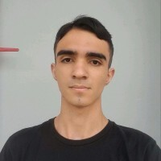

# 🚀 2DSM-ABP-UNDEFINED

Este repositório contém o desenvolvimento do projeto interdisciplinar da disciplina de **Aprendizagem Baseada em Problemas (ABP)** do curso de **Desenvolvimento de Software Multiplataforma** da FATEC Jacareí.

---

## 📌 Sumário

- [📖 Sobre o Projeto](#-sobre-o-projeto)
- [🛠️ Tecnologias Utilizadas](#️-tecnologias-utilizadas)
- [📑 Requisitos](#-requisitos)
  - [✅ Requisitos Funcionais](#-requisitos-funcionais)
  - [⚙️ Requisitos Não Funcionais](#️-requisitos-não-funcionais)
- [📝 User Stories](#-user-stories)
- [🧑‍💻 Integrantes](#-integrantes)

---

### 🚀 Planejamento de Sprints
---
<ul>
  <li><a href="#sprint-1">⏱️ Sprint 1</a>
      <ul>
        <li><a href="#backlog-sprint-1">📋 Backlog</a></li>
        <li><a href="#burndown-sprint-1">📉 Burndown</a></li>
      </ul>
    </li>
  <li><a href="#sprint-2">⏱️ Sprint 2</a>
      <ul>
        <li><a href="#backlog-sprint-2">📋 Backlog</a></li>
        <li><a href="#burndown-sprint-2">📉 Burndown</a></li>
      </ul>
    </li>
  <li><a href="#sprint-3">⏱️ Sprint 3</a>
      <ul>
        <li><a href="#backlog-sprint-3">📋 Backlog</a></li>
        <li><a href="#burndown-sprint-3">📉 Burndown</a></li>
      </ul>
    </li>
</ul>

---
## 📎 Links

<ul>
  <li>
    <strong>Trello:</strong>
    <a href="https://trello.com/b/T7wMGhWx/2dsm-abp-undefined" target="_blank">
      Acessar Trello
    </a>
  </li>
  <li>
    <strong>Figma:</strong>
    <a href="" target="_blank">
      Acessar Figma
    </a>
  </li>
  <li>
    <strong>Sistema:</strong>
    <a href="" target="_blank">
      Acessar sistema
    </a>
  </li>
</ul>

## 📖 Sobre o Projeto

...
---

## 🛠️ Tecnologias Utilizadas

O desenvolvimento será realizado com as seguintes tecnologias, visando garantir performance e acessibilidade na aplicação.

### 🔧 Stack Principal
<li>  React </li>
<li>  TypeScript </li>
<li>  CSS </li>
<li>  PostgreSQL </li>

---

## 📑 Requisitos

### ✅ Requisitos Funcionais

_A definir_

---

### ⚙️ Requisitos Não Funcionais

_A definir_

---

## 📝 User Stories

_A definir_

---

## 🚀 Planejamento de Sprints

## ⏱️ Sprint 1

### 📋 Backlog Sprint 1

_A definir_

### 📉 Burndown Sprint 1

_A definir_

---

## ⏱️ Sprint 2

### 📋 Backlog Sprint 2

_A definir_

### 📉 Burndown Sprint 2

_A definir_

---

## ⏱️ Sprint 3

### 📋 Backlog Sprint 3

_A definir_

### 📉 Burndown Sprint 3

_A definir_

---

## 🧑‍💻 Integrantes

| Foto | Nome Completo | Papel | LinkedIn | GitHub |
|------|---------------|--------|----------|--------|
|  | Marcus Vinicius Ribeiro do Nascimento | Product Owner | [LinkedIn](https://www.linkedin.com/in/marcus-nascimento-50a0ba1b5) | [GitHub](https://github.com/MarcusVRDN) |
|  | Pedro Augusto Gomes | Scrum Master | [LinkedIn](https://www.linkedin.com/in/pedro-augusto-gomes) | [GitHub](https://github.com/PedrinhoDBR) |
|  | Israel da Silva Lemes | Dev | [LinkedIn](https://www.linkedin.com/in/israel-lemes/) | [GitHub](https://github.com/Israelisl) |
|  | João Paulo Lorena Dias da Silva | Dev | [LinkedIn](https://www.linkedin.com/in/jo%C3%A3o-lorena-056b95271) | [GitHub](https://github.com/Jonnaes) |
|  | Nadla | Dev | [LinkedIn](https://www.linkedin.com/in/) | [GitHub](https://github.com/) |
| — | Rainan de Oliveira Reis | Dev | [LinkedIn](https://www.linkedin.com/in/rainan-reis-757384365/) | [GitHub](https://github.com/RainanKaneka) |
|  | Thales Cambraia Dias | Dev | [LinkedIn](https://www.linkedin.com/in/thales-tcd/) | [GitHub](https://github.com/thalestcd) |